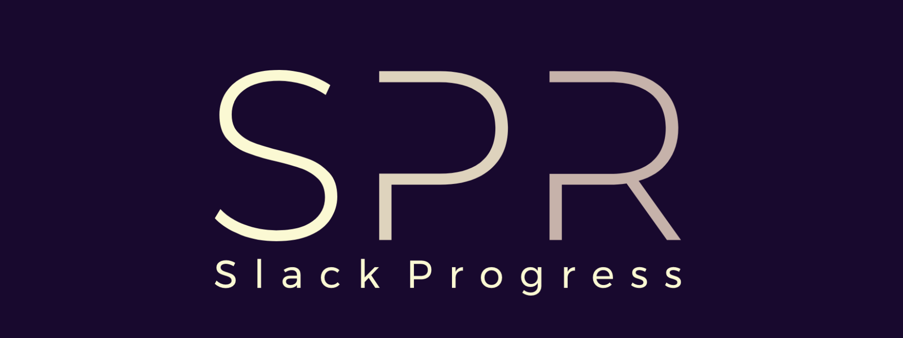

<p align="center">
  <a href="https://github.com/skmatz/spr">
    
  </a>
</p>

<p align="center">
  <a href="./LICENSE">
    
  </a>
  <a href="https://github.com/skmatz/spr/releases/latest">
    
  </a>
</p>

<p align="center">
  
</p>

## Overview

The **Slack Progress** helps you monitor your deep learning activity with Slack.

## Install

```sh
pip install git+https://github.com/skmatz/spr.git
```

## Usage

```python
from time import sleep

from spr import SlackProgress


def main():
    sp = SlackProgress()

    value = 0.0

    for _epoch in sp.progress(range(10)):
        value += 1.0
        sp.set_params({"value": value})

        sleep(1)


if __name__ == "__main__":
    main()
```

You can run [example.py](example.py) with:

```sh
TOKEN=xxx CHANNEL=yyy python example.py
```
